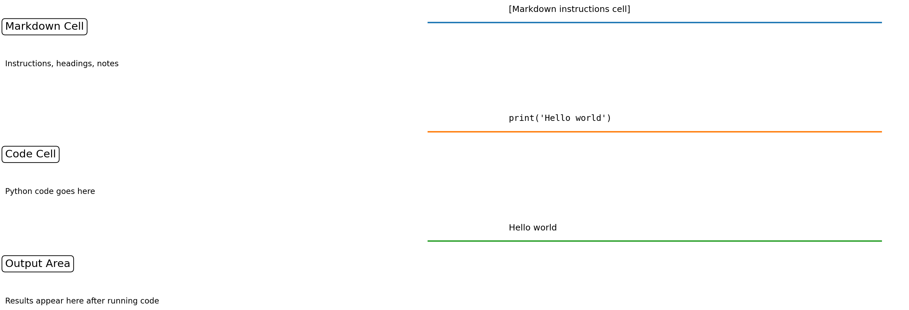

# 12 How to Use the Practice Notebooks

This is the main student instruction file for using the sample Jupyter notebooks in this repository.

The goal is not just to finish notebooks quickly.
The goal is to learn how to solve problems, test ideas, debug mistakes, and use AI well.

For week-by-week pacing, also see [17-four-week-study-plan.md](./17-four-week-study-plan.md).

---

## Start Here

Complete the notebooks in this order:

1. `notebooks/00-notebook-basics-practice.ipynb`
2. `notebooks/01-python-todo-practice.ipynb`
3. `notebooks/02-pandas-data-practice.ipynb`
4. `notebooks/03-api-and-json-practice.ipynb`
5. `notebooks/04-ai-assisted-problem-solving-practice.ipynb`
6. `notebooks/05-mini-classic-ai-challenge.ipynb`
7. `notebooks/06-mini-agentic-ai-challenge.ipynb`
8. `notebooks/07-debugging-practice.ipynb`
9. `notebooks/08-plotting-and-interpretation.ipynb`
10. `notebooks/09-agentic-workflow-practice.ipynb`
11. `notebooks/10-multi-step-data-investigation.ipynb`

Do not skip straight to the hardest notebook.

---

## How to Work Through a Notebook

For each notebook:

1. Read the instructions first.
2. Try the task yourself before using AI.
3. Change one small thing at a time.
4. Run the cell.
5. Check the output.
6. If stuck, ask AI one focused question.
7. Test the result again.
8. Be able to explain what changed and why.

---

## What Good Practice Looks Like

Good practice means:
- reading carefully
- testing your work
- checking whether the answer makes sense
- fixing small mistakes instead of giving up
- using AI as a helper, not autopilot

---

## What To Do If You Get Stuck

Try these steps:

1. Reread the instructions.
2. Check earlier cells.
3. Read the error message.
4. Print values to inspect what is happening.
5. Ask AI a specific question.
6. Try one small fix.
7. Test again.
8. Ask a teammate or mentor after you have tried.

---

## Good Questions to Ask AI

- What does this error message mean?
- What is this code doing step by step?
- Why is this function returning the wrong result?
- What should I inspect first?
- Can you help me debug this without giving the final answer?
- I expected X but got Y. What could cause that?

---

## How to Know You Are Done

You are in good shape when you can:
- run the notebook successfully
- explain what the code is doing
- describe what you changed
- show that you tested the result
- explain why the answer makes sense

---

## After the First 7 Notebooks

Once you finish notebooks 00-06, move into the deeper practice notebooks to build more confidence:

- use `07-debugging-practice.ipynb` if errors slow you down
- use `08-plotting-and-interpretation.ipynb` to practice chart reading
- use `09-agentic-workflow-practice.ipynb` to get a more realistic workflow experience
- use `10-multi-step-data-investigation.ipynb` to connect several data skills together

---

## Data File Note

Some notebooks load CSV files from the repo `data/` folder. The notebooks include a small setup cell that checks common file locations automatically.

---

## Final Reminder

The notebooks are not just there to give you answers.

They are there to help you learn how to:
- think through a problem
- work in Jupyter notebooks
- debug mistakes
- use AI wisely
- build confidence step by step

For practical help using free AI accounts, see `16-using-free-ai-tools.md`.
